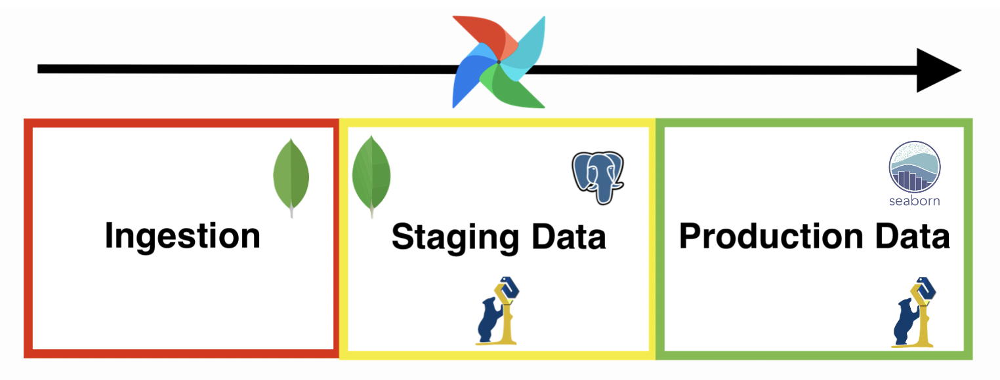

Requirements::
- [ ] example dataset so that testing can work offline
- [ ] have detailed description of the various steps
- [x] docker-compose file for environment
- [x] datasets from two different data sources (e.g. different formats)
- [x] ingest data from source to transient storage
- [x] cleaning, wrangling and enriching data and store in durable storage
- [x] have permanent storage
- [ ] deploy queries to answer questions
- [ ] visualization

# cute-whales
**A small  Data Engineering project on whether a connection can be found between deaths and temperature.**

by Antoine Krull, Danja Bauer and Synne .. 

# Project Presentation
As we want to analyze the correlation between the number of deaths and various aspects of termperatures, we formulated the following questions:
1. Is there a correlation between temperature variations and mortality rates in major cities (Berlin, Paris)?
2. How do temperature-related factors, such as extreme heat events or prolonged cold spells, impact rates in specific regions (Berlin, Paris)?

Additionally we want to use our data pipeline to visualize our findigs.

# Data Sources
Initially, we wanted to look into whale migration patterns and various influencing factors such as sea temperature.
However it was impossible to obtain a complete dataset for sea temperature. \
Meanwhile we found good data sets for land temperature.\
Afterwards we searched the web for a suitable accompanying dataset.
Here we discovered that the number of deaths are well-documented across different countries. \
To facilite handling, we decided to focuse our research on France and Germany with a possible expansion on data from Norway as we understand German, Norwegian and French.

Therefore we utilize: 
- the German Federal Office of Statistics
- Insee (the French equivalent) 
- Kaggle 

to obatin the necesssary data.

# Project Lifecycle
This is the overall structure of our data pipeline. \

## Ingestion Phase
During the ingestion phase, we sourced our data from the mentioned sources, performed a small number of cleansing operations and loaded the refined data into MongoDB.

### 1. French Death Data Ingestion
The data obtained from Insee is initially in txt format and distributed across multiple files. Moreover it is quite large as it contains one entry for every dead person since 1970, and since we already know that our research will focus soly on Paris, we also conduct filtering operations. 

The ingestion process is divided into the following tasks whch are executed in the respective order: 
- get_death_file_list(): gets the urls of all the text files
- get_all_death_files(): downloads all the data files
- collect_specific_location_data(): combines all the files while retaining only the individuals who died in Paris
- death_data_to_csv(): parses the txt file to a csv file in order to facilitate the ingestion into mongoDB
- import_deaths_csv_to_mongodb(): creates a mongo collection and inserts the data from the csv file

### 2. German Death Data Ingestion
The data obtained from the German Federal Office of Statistics is in json format

### 3. Temperature Data Ingestion

## Staging Phase

### 1. French Data Wrangling
As our interest lies in the number of deaths for each month, a crucial step involves summarizing the data.

The task called wrangle_death_data_in_mongodb() handels this step. Here an aggregation pipeline counts the deceased for each month and year and stores this count, together with the month and year, in a new collection.

### 2. Merging
A big part of our project consists of merging the different datasets. We divided this into two phases.

First we merge the Berlin and the Paris death datasets simply by parsing all documents into a single collection.

Afterwards this collection is merged with the temperature data.
The approach we apply here is a left outer join between the death and the temperature collection on the year, month and region where we stash the temperature data in an array. Then we create a new document for each document in the death collection and add the temperature value to the respective entry and insert this into a new collection called deaths_and_temperature.

-- add picture of deaths_and_temperature entry--

### 3. Storage
Now we add our data to Postgres in order to make it permanent.

## Production Phase
In this phase of the data pipeline we use the following queries to help answer our initial questions:
- cc
- xx

# Difficulties?

# Further considerations & ideas
Building up on our findings, one could analyze the influence of additional weather-related factors, such as varying humidity levels or extreme wind, on the number of deaths. This could be accomplished by icorporating a corresponding dataset. \
Furthermore, the correlations could be examined for other cities, broadening the scope of our analysis.