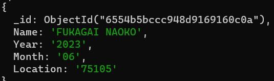
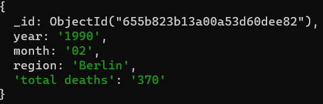
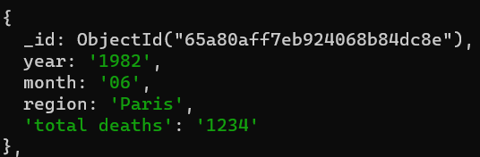

# Cute-whales Project
**A small project exploring the potential connection between deaths and temperature, conducted by Antoine Krull, Danja Bauer and Synne Trettenes for the course Foundation of Data Engineering 2023 at INSA Lyon.**

## Table of contents
- [Introduction](#introduction)
- [Data Sources](#data-sources)
- [Project Lifecycle](#project-lifecycle)
  - [Ingestion Phase](#ingestion-phase)
    - [French Death Data Ingestion](#french-death-data-ingestion)
    - [German Death Data Ingestion](#german-death-data-ingestion)
    - [Temperature Data Ingestion](#temperature-data-ingestion)
  - [Staging Phase](#staging-phase)
    - [French Data Wrangling](#french-data-wrangling)
    - [Merging](#merging)
    - [Storage](#storage)
  - [Production Phase](#production-phase)
    - [Queries](#queries)
      - [Question 1:](#question-1)
      - [Question 2:](#question-2)
    - [Data visualization](#data-visualization)
- [Difficulties](#difficulties)
- [Further considerations \& ideas](#further-considerations--ideas)
- [Project Submission Checklist](#project-submission-checklist)
- [How to run?](#how-to-run)
    - [Let's run the docker image.](#lets-run-the-docker-image)
    - [For the production phase:](#for-the-production-phase)

# Introduction
As we want to analyze the correlation between the number of deaths and various aspects of temperatures, we formulated the following questions:
1. Is there a correlation between temperature variations and mortality rates in major cities (Berlin, Paris)?
2. How do temperature-related factors, such as extreme heat events or prolonged cold spells, impact rates in specific regions (Berlin, Paris)?

Additionally we want to use our data pipeline to visualize our findings.

# Data Sources
Initially, we wanted to look into whale migration patterns and various influencing factors such as sea temperature.
However it was impossible to obtain a complete dataset for sea temperature.
Meanwhile we found good data sets for land temperature.
Afterwards we searched the web for a suitable accompanying dataset.
Here we discovered that the number of deaths are well-documented across different countries. \
To facilite handling the data, we decided to focuse our research on France and Germany with a possible expansion on data from Norway as we understand German, Norwegian and French.

Therefore we utilize: 
- [DeStatis](https://www.destatis.de/DE/Home/_inhalt.html) (the German Federal Office of Statistics)
- [Insee](https://www.insee.fr/fr/accueil) (the French Federal Office of Statistics) 
- Kaggle 

to obatin the necesssary data.

# Project Lifecycle
**This is the overall structure of our data pipeline.** 

We also build a docker image to allow for better testing and coherance between us. Its set up is explained in [How to run?](#how-to-run).

## Ingestion Phase
**During the ingestion phase, we sourced our data from the mentioned sources, performed a small number of cleansing operations and loaded the refined data into MongoDB.**

### French Death Data Ingestion
The data obtained from Insee is initially in TXT format and distributed across multiple files. Moreover it is quite large as it contains e.g. one entry per dead person since 1970, therefore we conduct multiple filtering operations. 

Its ingestion process is divided into the following tasks which are executed in the respective order: 
- `get_death_file_list()` - gets the urls of all the text files
- `get_all_death_files()` - downloads all the data files
- `collect_specific_location_data()` - combines all data files while retaining only the individuals who died in Paris
- `death_data_to_csv()` - parses the txt file to a csv file in order to facilitate the ingestion into mongoDB
- `import_deaths_csv_to_mongodb()` - creates a mongo collection and inserts the data from the csv file finally

This is what an entry in the French death collection looks like right now: \

### German Death Data Ingestion
The German Federal Office of Statistics provides in CSV format which allows for easy parsing and insertion into our MongoDB database.
This way we perform slight adjustments during the insertion process including the implementation of a numerical month format in `get_number_of_month` and the addition of a comlumn for specifying Berlin as the region.

This is what the Berlin data looks like: \

### Temperature Data Ingestion
The temperature data from Kaggle is provided in JSON format, however it contains an abundance of information.
Therefore we adjust the data slightly while importing it in the function `import_clean_temperature_data()`.\
We begin by dropping multiple columns such as the temperature uncertainty.
Moreover we exclude entries before 1980 as this enhances the compatibility with our death data and we retain only entries correspond to Berlin and Paris.
Lastly we convert the refined data into a csv file facilitating its subsequent parsing into the database.

Underneath you can see the format of the temperature data: \

## Staging Phase
**In the staging phase we perform some data wrangling, merging of our data and we store it permanently into Postgres.**

### French Data Wrangling
As our interest lies in the number of deaths for each month, a crucial step involves summarizing the data.

The task called `wrangle_death_data_in_mongodb()` handels this step. Here an aggregation pipeline counts the deceased for each month and year and stores this count, together with the month and year, in a new collection called `fr_deaths_clean`.

The images below illustrate the effects of our wrangling: \

### Merging
A big part of our project consists of merging the different datasets. We divided this into two phases:

First we merge the Berlin and the Paris death datasets simply by parsing all documents into a single collection.
Afterwards this collection is merged with the temperature<<|||>>>><> data.
The approach we apply here is a left outer join between the death and the temperature collection on the year, month and region where we stash the temperature data in an array. Then we create a new document for each document in the death collection and add the temperature value to the respective entry and insert this into a new collection called `deaths_and_temperature`.

The image below illustrate the fist merge of all the deaths: \

The second image illustates the deahts and temperature collection: \

### Storage
Now we add our data to a PostgreSQL database in order to make it permanent.
This process is achieved by using SQL queries 

Here is an example of what our data looks like in the database: \

## Production Phase
During the production phase of the data pipeline, we perform two key tasks: visualizing the data within the PostgreSQL database and querying the database to calculate the correlation coefficient between temperature and total deaths in a region for each month. \
The visualization process involves creating a heatmap using seaborn, a Python data visualization library based on matplotlib. 

### Queries
To examine the correlation coefficient between the temperature and the total deaths in a specific region and given month, we execute a query on the PostgreSQL database. The following formula represents the correlation coefficient, denoted as 'r', which serves as a measure indicating the strength and direction of the relationship between the two variables:

$$r=\frac{n\sum xy - \sum x \sum y}{\sqrt{((n\sum x^2) - (\sum x)^2) * ((n\sum y^2) - (\sum y)^2)}}$$

n → number of observations, x and y → temperature-variable and death-variable, Σ → summation of a series.\
The correlation coefficient (r) varies between -1 and 1. A value of -1 signifies a perfect negative relationship, a value of 1 denotes a perfect positive relationship, and a value of 0 indicates no relationship between the variables being analyzed.

#### Question 1: 
This task calculates the correlation coefficient between temperature and total deaths for a specified month and region. The code retrieves user-defined variables for month and region, performs SQL queries on the PostgreSQL database, and computes the correlation using a mathematical formula. \
The output of the query looks like this:

#### Question 2: 
Similar to the previous task, we compute the correlation coefficient incorporating an additional condition based on a temperature threshold. This condition considers only data points where the temperature is greater than or equal to the specified threshold. The threshold can vary. \
The output of the query looks like this:

### Data visualization

The visualization is done by creating a heatmap. The create_heatmap function is designed to visualize the correlation coefficients between total deaths and temperature across different months and regions. Values close to 1 or -1 indicate strong correlations, while values close to 0 suggest a weaker correlation.

The `calculate_correlation` function is called with a specified threshold, generating output that is transformed into a DataFrame named `df`. 
The DataFrame contains columns labeled 'Month', 'Region', 'Correlation coefficient', and 'Threshold'. \
To ensure clean data, we remove rows with null values in the 'Correlation coefficient' column.
Subsequently, the Seaborn library `sns` is used to create a scatter plot with a linear fit. This plot illustrates the relationship between 'Month' and 'Correlation coefficient', with the x-axis represents the 'Month', and the y-axis represents the 'Correlation coefficient'. 

**First Question**

Through this heatmap, we can see that the majority of the values for both regions are close to zero. This suggests a weaker correlation between temperature and deaths across different months of the year. As provided we can also see that it is suggested a hight correlation for February month in Paris. So try to stay out of Paris in February!

**Second question**

When analyzing the heatmap for the second question, it becomes noticable that there relatively few values indicating that most of the months do not have an average temperature above 20 degrees celsius. From the available values, we observe that all of them are closer to 0 rather then -1 or 1, suggesting a weak correlation between temperatures above 20 degrees and deaths across various months of the year.

# Difficulties
**In this section we will dive into certain difficulties we encountered.** \
Firstly, we faced several with Postgres, taking up a lot of our time. These challenges encompassed connection errors, issues with data types and other abstract errors. However we were able to tackle these challenges by creating a new Postgres container and defining a docker-compose.yaml. \
Secondly creating a pipeline that works seamlessly on all team members' PCs proved to be difficult as each person encountered different errors.\
Lastly to resolve errors related to accessing the Docker container arise, we implemented the function `get_mongo_container_id()` to retrieve the Mongo container ID. Despite these efforts, we were unable to achieve complete reliability, therefore we've resorted to set the ID globally.

# Further considerations & ideas
Building up on our findings, one could analyze the influence of additional weather-related factors, such as varying humidity levels, extreme wind or preciptation, on the number of deaths. This could be accomplished by incorporating a corresponding dataset. \
Furthermore, the correlations could be examined for other cities, broadening the scope of our analysis.

# Project Submission Checklist
- [x] [repository](https://github.com/antoinekrull/cute-whales)  with well documented code
- [x] detailed description of the various steps in the report
- [x] [slides](https://docs.google.com/presentation/d/1aI4sPVWvZ66XHZxIjAxhFMCXNTLYlBP9FIW84YUmREE/edit?usp=sharing) for the project presentation
- [x] docker-compose file for environment
- [x] datasets from two different data sources (e.g. different formats)
- [x] ingest data from source to transient storage
- [x] cleaning, wrangling and enriching data and store in durable storage
- [x] have permanent storage
- [x] deploy queries to answer questions
- [x] visualization

# How to run?
### Let's run the docker image.

1. Make sure Docker Desktop is running.
2. Run `mkdir -p ./dags ./logs ./plugins ./config` and `echo -e "AIRFLOW_UID=$(id -u)" > .env`
3. Run `docker-compose up airflow-init`, run database migrations and create the first user account.
4. Build and run the environment using the `docker-compose up`.
5. In a new terminal, run `docker ps` to get the mongo container id and copy this.
6. In the `dag.py` file on line 29, paste your mongo container id.
7. Connect to the airflow dashboard `localhost:8080`, where username and password are `airflow`
8. Add a connection to the postgreSQL database by navigating to Admin -> Connections, then click the blue `+`.

Then put in the following data:

* Name - postgres_db
* Conn type -postgres
* Host - db
* Port - 5432
* Database - postgres
* Username - test
* Password - test

### For the production phase:
1. Make sure you've got jupyter notebook installed or install it using `pip install notebook`
2. Open a terminal and navigate to the right repo
3. Run `jupyter notebook` to acces the production.ipynb-file
If you cannot acces this file just run production.py
