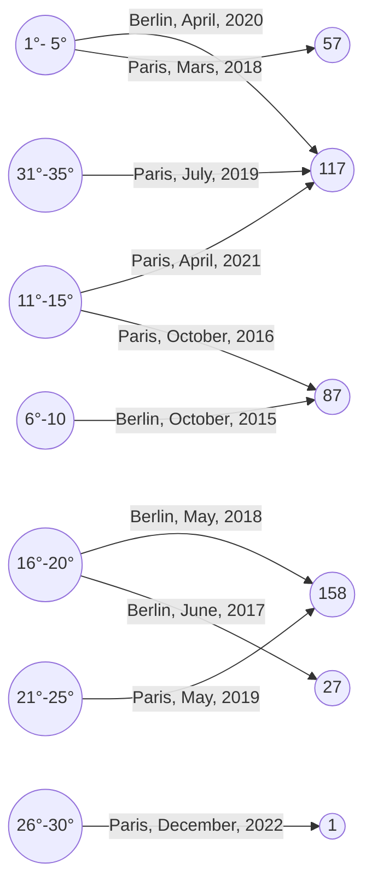

# TODOS
- [x] **A**: wrangle the temperature data, remove not needed colums. Format (year, month, region, temperature)
- [ ] **A**: finish all the operators in the dag
- [x] **A**: wrangle berlin death data. Months need to be given from 01-12, and a Region colum. Format: (year, month, region, total deaths)
- [ ] **D**: wrangle the french data, count the number of names in given moths of given years. Format: (year, month, region, total deaths)
- [ ] merge deaths datasets to one death collection
- [ ] merge death data with temperature data. Format: (year, month (int), region, temperature, total deaths)
- [ ] save data to postgres on format: (year, month (int), region, temperature, total deaths)
- [ ] **Everybody**: Make presentation slides (each person make slides bout the things they have coded)
- [ ] **S**: Fix the airflow broken DAG error

# cute-whales
A project for the data engneering class at INSA Lyon.

### Presentation
[Click here to go to the presentation](presentation.md)

## Get started
1. make sure Docker Desktop is running.
2. run `mkdir -p ./dags ./logs ./plugins ./config` and `echo -e "AIRFLOW_UID=$(id -u)" > .env`
3. Run `docker-compose up airflow-init` run database migrations and create the first user account.
4. Build and run the environment using the `docker-compose up` command.
5. Connect to the airflow dashboard [localhost:8080](http://localhost:8080/), where user and password is `airflow`
6. Add a connection to the postgres SQL database. Navigate To the Admin -> Connections menu, then click the blue + button to add a new connection.
After it is up, add a new connection:

After it is up, add a new connection:

* Name - postgres_default
* Conn type - postgres
* Host - localhost
* Port - 5432
* Database - airflow
* Username - airflow
* Password - airflow

# Project presentation
There is said that there can be found a connection between temperature and death. Through our pipeline 
we will try to both find and visualize a link by ingesting three different datasets with, wrangle them to a preferred format and visualize the data through a graph database in order to answer the following questions: 

### Questions:

Question 1: Are there correlations between temperature variations in major cities around the world and mortality rates in different regions of Germany and France?

Question 2: How do temperature-related factors, such as extreme heat events or prolonged cold spells, impact mortality rates in specific regions, and can we identify vulnerable regions?

Our data will be structured something like this, with an example:
| Year | Month | Number of deaths | Region | Temperature | 
| -------- | -------- | -------- | -------- | -------- |
| value  | value   | value  | value   | value  |
| 2020  | July   | 204   | Paris   | 40 (celsius)   |
| 2018  | September   | 178   | Berlin   | 19 (celsius)   |

The vislualization will :

## Data sources
The project utilises three different datasources:

### Temperature 
This dataset contains information about XXX in a .json-file an is structured with coloums XXX
- Include visualization of the data (?)

### Deaths in France
This dataset contains information about XXX in a .txt-file an is structured with coloums XXX
- Include visualization of the data (?)

### Deaths in Berlin
This dataset contains information about XXX in a .csv-file an is structured with coloums XXX
- Include visualization of the data (?)

## Data Pipeline Design

### Ingestion (Pipeline 1):
Ingest city temperature data from sources.
Ingest German and French mortality data from sources.
Store this data in a landing zone, which could be cloud-based storage or a local database.
Use Apache Airflow to automate data ingestion and schedule updates.

- Explain how we ingest the data
- Inclue an image of the collections in MongoDB
- Include image of DAG (?)

### Staging (Pipeline 2):
Clean and preprocess the raw data, addressing missing values or inconsistencies.
Join the cleaned whale movement data with oceanographic data to enrich the dataset.
Transform the data into a structured format suitable for analysis.
Persist the combined data into a staging zone for durability.

- Include image of DAG (?)
- Include image of postgres database and how data is saved in table
- Include a STAR-diagram of the postgres

### Production Analytics (Pipeline 3):
For the production phase of the data pipeline we both visualize the data in the postgres-database, as well as query the database in order to caluculate the correlation coeficient between the temperature and the total deaths in a region, for every month. The visualization part is done by creating a a heatmap using seaborn, which is a Python data visualization library based on matplotlib. The x-axis contains the all the months in the dataset and the y-axis visualizes the correlation coefficient. 

- TODO: legge til bilde av STAR-scheme

#### Queries
To look at the correlation coefficient between the temperature and the total deaths in a region and given month we query the postgres-database. The formula represents the correlation coefficient, denoted as r, which is a measure of the strength and direction of the relationship between two variables:

$$r=\frac{n\sum xy - \sum x \sum y}{\sqrt{((n\sum x^2) - (\sum x)^2) * ((n\sum y^2) - (\sum y)^2)}}$$

n → number of observations, x and y → temperature-variable and death-variable, Σ → summation of a series.
The value of r ranges from -1 to 1. A value of -1 indicates a perfect negative relationship, a value of 1 indicates a perfect positive relationship, and a value of 0 indicates no relationship.

Question 1: \
This task calculates the correlation coefficient between temperature and total deaths for a specified month and region. The code retrieves user-defined variables for month and region, performs SQL queries on the PostgreSQL database, and computes the correlation using a mathematical formula. The output of the query will be on thsi form:

`[{'Month': month, 'Region': region, 'Correlation coefficient': query_without_threshold(cursor, region, month), 'Threshold': "None"}]`

Example:
`[{'Month': 1, 'Region': 'Paris', 'Correlation coefficient': -0.9607689228305124}, {'Month': 2, 'Region': 'Paris', 'Correlation coefficient': 0.9347195428044848}, ...]`

Question 2: \
Similar to the previous task, this calculates the correlation coefficient, but with an additional condition based on a temperature threshold. It considers only data points where the temperature is greater than or equal to the specified threshold. The threshold can vary, but for extreme heat the value will be 32°. The output of the query will be on thsi form:

`[{'Month': month, 'Region': region, 'Correlation coefficient': query_without_threshold(cursor, region, month), 'Threshold': 32.0}]`

Example:
`[{'Month': 1, 'Region': 'Berlin', 'Correlation coefficient': -0.7607689228305124}, 'Threshold': 32.0, {'Month': 2, 'Region': 'Berlin', 'Correlation coefficient': 0.5347195428044848}, 'Threshold': 32.0, ...]`

#### Data visualization
- TODO: fullfør avsnitt \

The visualization is done by creating a heatmap. The create_heatmap function is designed to visualize the correlation coefficients between total deaths and temperature across different months and regions. Values close to 1 or -1 indicate strong correlations, while values close to 0 suggest a weaker correlation.

The calculate_correlation function is called with a specified threshold, and the output is converted into a DataFrame named df. The DataFrame columns are named 'Month', 'Region', 'Correlation coefficient', and 'Threshold'.
Data Cleaning: Rows with null values in the 'Correlation coefficient' column are dropped to ensure a clean dataset.
The Seaborn library (sns) is used to create a scatter plot with a linear fit for the relationship between 'Month' and 'Correlation coefficient'. The x-axis represents the 'Month', and the y-axis represents the 'Correlation coefficient'.

The resulting visualization provides a quick overview of how the correlation coefficients vary across different months and regions. Negative values indicate a negative correlation, while positive values indicate a positive correlation. The strength of the correlation is determined by the magnitude of the coefficient.

### Future work
For futire work there are several posibilities for the pipeline. We can add more types of weather data in order to answer the second question. In addition to temaerature data, we can add windspeed-data with a threshold for extreme wind, or precipitation data with a threshold for extreme precipitation, etc. We also have the possibility to add death numbers for more regions than just Paris and Berlin. At the same time we can also add the temperature-column for the regions added by cleaning the datasett differently. 